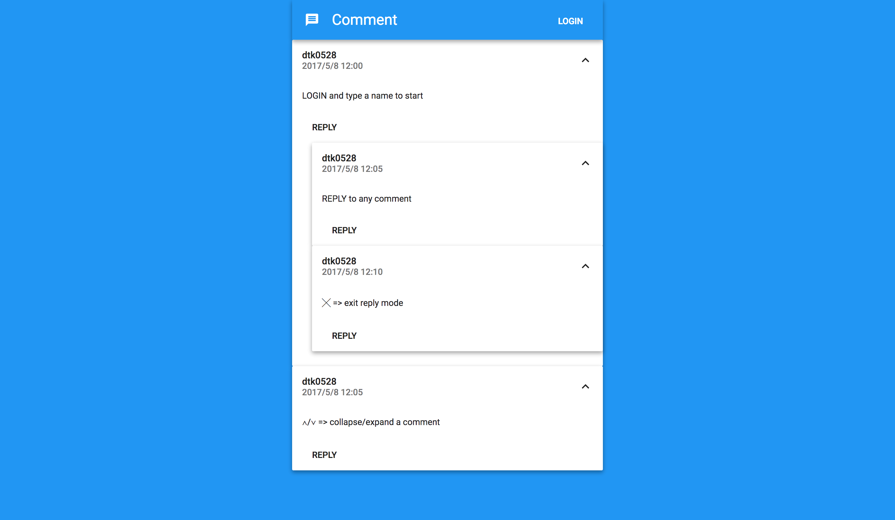

Comment Page
=========
  
  

## Demo

A working live demo [https://comment-page.now.sh](https://comment-page.now.sh)

## Features

* Leave comments
* Show comments timestamp
* Reply to comments

---

## Setup

#### Get the source code  

	git clone https://github.com/dtk0528/comment-page.git
	cd comment-page
	
#### Download and install all the dependencies (in server/ and client/)

	yarn install
  
---
	
## Usage

#### Build the app for production (in client/)

	yarn run build

#### Start the server (in server/)

	yarn start

#### Open a browser and go to

	localhost:3001

---

## Built With

* [Express](http://expressjs.com/) - Web framwork for Node.js.
* [React](https://facebook.github.io/react/) - A JavaScript library for building user interfaces

---

## License

This project is under the MIT license. You are free to do whatever you want with it.
